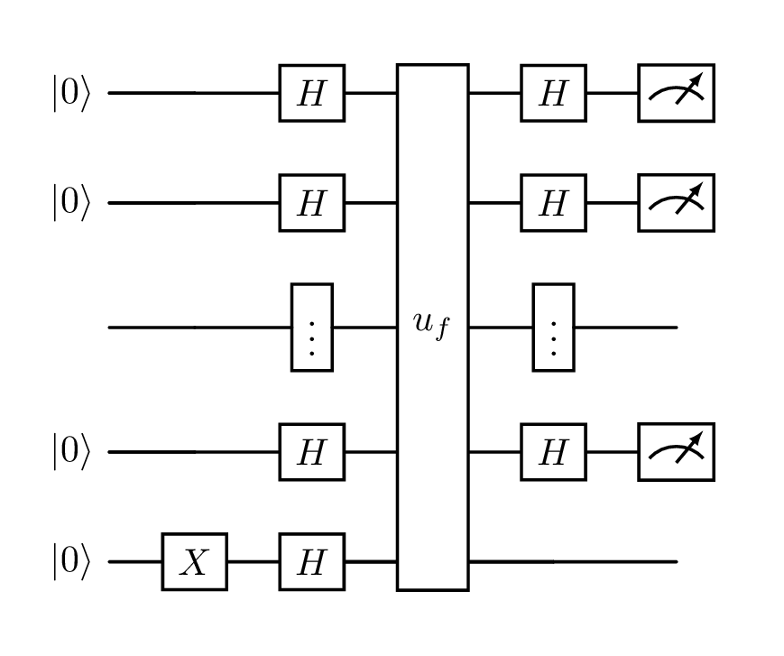

# qzfr (quantikzifier)
Docker image to quickly compile quantikz code into images

This is solving a problem that maybe only I have, and it may be solely to do with my broken local LaTex setup

I'm using [Texifier](https://www.texifier.com/) which has a lovely live-reloading functionality.
Sadly I can't seem to get this to work with the [quantikz](https://mirrors.ibiblio.org/CTAN/graphics/pgf/contrib/quantikz/quantikz.pdf) package for generating diagrams of quantum circuits.

So I've built a janky Docker setup which takes a tex file containing just a `\begin{quantikz} blah \end{quantikz}` block, substitutes it into a basic LaTex document, and produces a PNG of that circuit!

Here is an example of the generated PNG:



## Docker Hub usage

I have shared this on Docker Hub for easy local usage

To compile the `test1.tex` file in this repo run:
```shell
docker run --rm -v ./test:/work/data adnathanail/qzfr test1.tex
```

To run this on any local file, replace `./test` with the path to the _folder_ containing your tex file(s), and replace `test1.tex` with the name of the tex file you would like to process

### M1 Mac usage

The Docker image is built for the `linux/amd64` platform.
To have Docker emulate this, specify the platform with an environment variable
```shell
DOCKER_DEFAULT_PLATFORM=linux/amd64 docker run --rm -v ./test:/work/data adnathanail/qzfr test1.tex
```

If you want this to persist, add the following to your shell's config file (e.g. `~/.zshrc` on macOS)
```shell
export DOCKER_DEFAULT_PLATFORM=linux/amd64
```

**Note this will affect all usage of Docker**

## Local usage
```shell
docker build -t qzfr .
docker run --rm -v ./test:/work/data qzfr test1.tex
```
