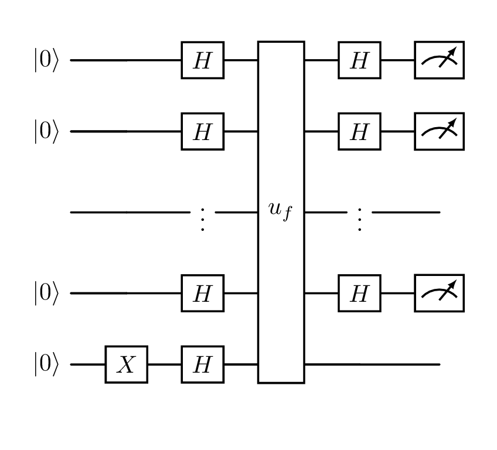
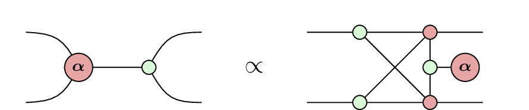

# qzfr (quantikzifier)
Docker image to quickly compile quantikz and TikZiT code into images

This is solving a problem that maybe only I have, and it may be solely to do with my broken local LaTex setup

I'm using [Texifier](https://www.texifier.com/) which has a lovely live-reloading functionality.
Sadly I can't seem to get this to work with the [quantikz](https://mirrors.ibiblio.org/CTAN/graphics/pgf/contrib/quantikz/quantikz.pdf) package for generating diagrams of quantum circuits.

So I've built a janky Docker setup which takes a file containing just a diagram, substitutes it into a basic LaTex document, and produces a PNG of that diagram!

The file extension decides how it is treated:

| Extension | Treated as | Expected contents |
| --------- | ---------- | ----------------- |
| `.tex`    | [quantikz](https://mirrors.ibiblio.org/CTAN/graphics/pgf/contrib/quantikz/quantikz.pdf) | a `\begin{quantikz} ... \end{quantikz}` block |
| `.tikz`   | [TikZiT](https://tikzit.github.io/) (e.g. ZX diagrams) | a `\begin{tikzpicture} ... \end{tikzpicture}` block, as saved by TikZiT |

Either way you only supply the diagram itself, the surrounding document boilerplate is added for you.

Here are examples of the generated PNGs:





### TikZiT style files

TikZiT diagrams reference styles (`Z dot`, `X phase dot`, ...) that live in `.tikzstyles`/`.tikzdefs` files.

If any `.tikzdefs`/`.tikzstyles` files sit in the same folder as your `.tikz` file, they are all pulled in automatically (defs first, then styles).
If there aren't any, the bundled ZX styles from [`tikzit/`](tikzit) are used instead.

You don't need to supply `tikzit.sty`, it ships with the image.

## Docker Hub usage

I have shared this on Docker Hub for easy local usage

To compile the `test1.tex` file in this repo run:
```shell
docker run --rm -v ./test:/work/data adnathanail/qzfr test1.tex
```

To compile the `test2.tikz` ZX diagram, run:
```shell
docker run --rm -v ./test:/work/data adnathanail/qzfr test2.tikz
```

To run this on any local file, replace `./test` with the path to the _folder_ containing your diagram file(s), and replace `test1.tex` with the name of the file you would like to process

### M1 Mac usage

The Docker image is built for the `linux/amd64` platform.
To have Docker emulate this, specify the platform with an environment variable
```shell
DOCKER_DEFAULT_PLATFORM=linux/amd64 docker run --rm -v ./test:/work/data adnathanail/qzfr test1.tex
```

If you want this to persist, add the following to your shell's config file (e.g. `~/.zshrc` on macOS)
```shell
export DOCKER_DEFAULT_PLATFORM=linux/amd64
```

**Note this will affect all usage of Docker**

## Local usage
```shell
docker build -t qzfr .
docker run --rm -v ./test:/work/data qzfr test1.tex
docker run --rm -v ./test:/work/data qzfr test2.tikz
```
